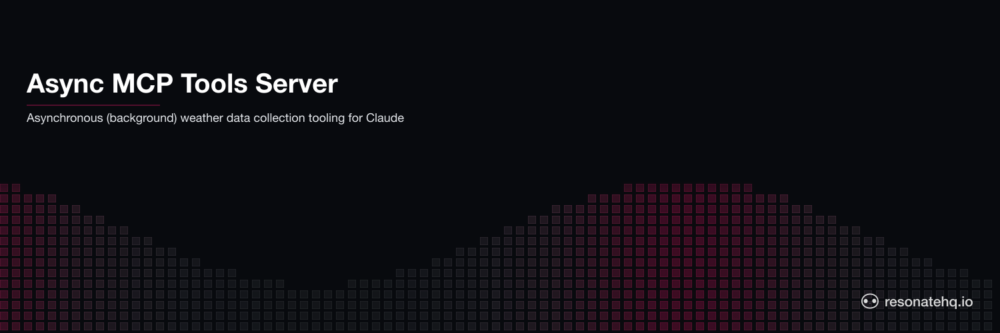

<p align="center">
  <picture>
    <source media="(prefers-color-scheme: dark)" srcset="./assets/banner-dark.png">
    <source media="(prefers-color-scheme: light)" srcset="./assets/banner-light.png">
    
  </picture>
</p>

# Weather data AI Agent tool | Resonate example application

This example application showcases Resonate's ability to convert synchronous MCP Server tools into Durable Asynchronous tools.

Because... if you are building an MCP server then you are also building a distributed system.

## The problem

The main issue with MCP, and all LLM tool calling functionality at present, is that it is synchronous with no built-in mechanisms for handling failure.

Even though MCP standardizes a tool calling convention - it ignores all the other issues that arise from building a distributed system and as the developer you are burdened with figuring out:

- Supervision, such as timeouts, to detect issues
- Retry logic for application level errors
- Deduplication and/or idempotency guarantees
- Recovery for process crashes

## The solution

The solution is promises.

The MCP Server Quickstart guide uses weather forecasting as an example use case.

This example flips it around and uses historic weather data gathering as our example, a use case which could take a much longer time and better reflect the need for a background job.

And, instead of a single tool such as get_weather_data, we will create three tools:

- `start_gathering()`
- `probe_status()`
- `await_result()`

The key is that the `start_gathering()` tool, instead of blocking on the result of the data gather job, kicks off a background job and returns a promise ID.

Integrating Resonate into a MCP server preserves the standardized tool calling while completely transforming it into a Durable Distributed System.

## How to run this example

You will need to:

- edit your claud_desktop_confg.json
- run a Resonate Server
- run an MCP transport proxy
- run the MCP server

### Edit claude_desktop_config.json

If you go to Claude's settings, there is a Developers tab which should provide access to the configuration file.

```json
{
  "mcpServers": {
    "weather": {
      "command": "/opt/homebrew/bin/uv", // Path to where uv is
      "args": [
        "--directory",
        "ABSOLUTE/PATH/TO/TOOL/agent-tool-weather-data",
        "run",
        "proxy.py"
      ]
    }
  }
}
```

### Start a Resonate Server

To get the most out of Resonate, you will want to have a Resonate Server running for your MCP Server to connect to.

```shell
brew install resonatehq/tap/resonate
resonate serve
```

## Run the proxy

Claude Desktop only connects to local MCP Servers via stdio.

In theory Resonate should be able to work with an MCP Server that runs on a stdio transport, however [a bug was discovered](https://github.com/resonatehq/resonate-sdk-py/issues/282) that needs to be fixed to enable that.

In the mean time you can run a proxy that coverts a stdio transport to talk with an MCP server running streamable-http transport.

```shell
uv run proxy.py
```

## Run the weather data MCP server

Then you can run the weather_data MCP Server:

```shell
uv run weather_data.py
```
